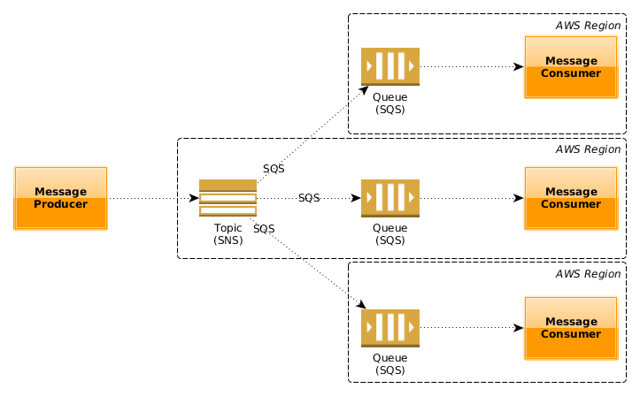

# AWS >> SQS  &&  SNS
[back to main](./README.md)


1-what is the difference between SQS and SNS?
2-What are some use cases for both SNS and SQS?

`Technical Comparison`

- `AWS Simple Notification Service (SNS)`

Service to set up, operate, and send notifications to subscribers of topics via multiple HTTP, Email, SQS, and SMS protocols.
SNS is generally used for sending plain text emails, which is triggered via other AWS Services. The best example of this is billing alarms.
Users can retry sending in case of failure for HTTPS.
Follows the publish-subscribe (pub-sub) messaging paradigm
Publisher establishes a connection with subscribers asynchronously by sending a message to a topic.
The topic contains a list of subscribers and methods to communicate with the theme.
Method containing subscribers’ cloud be SQS, HTTP(s), email, SMS, etc.
Suitable for webhooks, simple internal emails, triggering Lambda functions

- `AWS Simple Queue Service (SQS)`

Message Queuing Service which places messages in a queue it can retain a message for 14 days. Applications pull queue using AWS SDK.
It can send them in sequential order or parallel and ensure that messages are delivered at least once.
Fast, reliable, scalable, and fully managed by Amazon.
It is useful to DECOUPLE the component of a Cloud Application.
Can Transmit any volume of data to other services.
Ensure delivery of messages at least once.
Multiple readers and writers are possible for interacting with the same queue.
It is suitable for delayed tasks, queuing up emails




1-Describe how to use SQS and SNS in a “fanout” pattern.

2-Explain how “push notifications” work, using SNS


```js
// sample message
MyEvent myEvent = new MyEvent();
myEvent.setId(UUID.randomUUID().toString());
myEvent.setSource(Thread.currentThread().getName());
myEvent.setPayload("AWS SNS + SQS Fanout is fun!");
 
// serialise to JSON string
String message = null;
try {
    message = objectMapper.writeValueAsString(myEvent);
} catch (JsonProcessingException e) {
    logger.error(e);
}
 
if (message != null) {
    PublishRequest publishRequest = PublishRequest.builder().subject("Fanout Example").message(message).topicArn(topicArn).build();
    PublishResponse publishResponse = this.snsClient.publish(publishRequest);
    if (publishResponse.sdkHttpResponse().isSuccessful()) {
        logger.info("Message {} published", publishResponse.messageId());
    } else {
        logger.error("Failed to publish message {} to {}: {} - {}", publishResponse.messageId(), topicArn,
                publishResponse.sdkHttpResponse().statusCode(), publishResponse.sdkHttpResponse().statusText());
    }
}
```

- `Fanout SNS-SQS Gotcha`


One of the very common architectural patterns is fan-out where an event is sent to multiple subscribers by a broker. An event can be like placing an order, which can then be handled by inventory service, record-keeping, as well as shipping service concurrently. These events can also be very frequent - like clickstreams, or search strings on a website. AWS allows for fan-out architecture with SNS topics, and SQS queues. SQS queue(s) can subscribe to SNS topics and receive any message sent to the SNS topic(s). It is documented that FIFO queues cannot be SNS subscribers here.

However, as I recently found out, SSE-enabled SQS queues cannot subscribe to SNS either. While AWS stops us from subscribing a FIFO queue to SNS, SSE-enabled queues are allowed to subscribe, but they never get any events. The purpose of this post is to document this previously undocumented behavior.
Setup
We will create an SNS topic called fan-out-topic, and then create a SQS Standard Queue called fan-out-sink. We will create an IAM policy so the queue can receive messages from the topic, and finally we will subscribe the queue to the topic. Next, we will verify that the fan-out works. Finally we will enable SSE on the queue, and verify that the fan out no longer works.

I will use aws-shell CLI for all the operations.

Create an SNS topic
`aws> sns create-topic --name fan-out-topic`
Create the SQS queue
`aws> sqs create-queue --queue-name fan-out-sink`
Create an IAM policy
The SQS queue will need to have an associated IAM policy to allow the SNS topic to send message to it via SendMessage action.

This is where it gets interesting. AWS’s handling of assigning policies to SQS via CLI is really uncomfortable. Basically we’d need to flatten out the entire IAM policy JSON as a string, and put everything in a single line. We will create one file, call it /tmp/policy.json, with these contents. Your account IDs/ARNs will be different.
```js
{ "Policy" : "{ \"Version\": \"2012-10-17\", \"Id\": \"arn:aws:sqs:us-east-1:***********:fan-out-sink/SQSDefaultPolicy\", \"Statement\": [{ \"Sid\": \"Sid1508039487834\",\"Effect\": \"Allow\", \"Principal\": {\"AWS\": \"*\"},\"Action\": \"SQS:SendMessage\",\"Resource\": \"arn:aws:sqs:us-east-1:***********:fan-out-sink\",\"Condition\": {\"ArnEquals\": {\"aws:SourceArn\": \"arn:aws:sns:us-east-1:***********:fan-out-topic\"}}}]}"}
Associate this policy with SQS
aws> sqs set-queue-attributes --queue-url https://queue.amazonaws.com/***********/fan-out-sink --attributes file:///tmp/policy.json
Subscribe SQS to SNS
aws> sns subscribe --topic-arn arn:aws:sns:us-east-1:***********:fan-out-topic --protocol sqs --notification-endpoint arn:aws:sqs:us-east-1:***********:fan-out-sink
{
    "SubscriptionArn": "arn:aws:sns:us-east-1:***********:fan-out-topic:c0ddf05a-a62e-44dc-ac64-99da02a00fba"
}
```
The SubscriptionArn would mean that we do not need to confirm this subscription.

Try the fan-out : works!
Let’s publish a message on the topic
```js
aws> sns publish --message "Hello!" --topic-arn arn:aws:sns:us-east-1:***********:fan-out-topic
{
    "MessageId": "92ce4aac-c8b9-59b3-b4c3-18f02e3a1306"
}
..and receive it

aws> sqs receive-message --queue-url https://queue.amazonaws.com/***********/fan-out-sink
{
    "Messages": [
        {
            "Body": "{\n  \"Type\" : \"Notification\",\n  \"MessageId\" : \"d649c24e-fcac-5375-b1e5-901227c0fa47\",\n  \"TopicArn\" : \"arn:aws:sns:us-east-1:***********:fan-out-topic\",\n  \"Message\" : \"Hello!\",\n  \"Timestamp\" : \"2017-10-15T03:42:36.671Z\",\n  \"SignatureVersion\" : \"1\",\n  "MessageId": "88e5bca5-60a0-48ba-8148-67930dc3cee0"
        }
    ]
}
aws>
```
I’ve removed other response attributes for brevity.

We will then purge this queue before enabling SSE on it. Alternatively, we may choose to just delete the messages.
```js
aws> sqs purge-queue --queue-url https://queue.amazonaws.com/***********/fan-out-sink
Enable SSE on SQS
Since I have a CMK I had created earlier, I will use it’s alias. You may choose to use alias/aws/sqs if one does not exist, as this is a Managed CMK AWS uses to encrypt any SQS.

aws> sqs set-queue-attributes --queue-url https://queue.amazonaws.com/***********/fan-out-sink --attributes KmsMasterKeyId=alias/my-master-key
We can verify that the queue has SSE enabled by doing so -

aws> sqs get-queue-attributes --attribute-names KmsMasterKeyId --queue-url https://queue.amazonaws.om/***********/fan-out-sink
{
    "Attributes": {
        "KmsMasterKeyId": "alias/my-master-key"
    }
}
aws>
Try the fan-out : fails!
aws> sns publish --message "Hello!" --topic-arn arn:aws:sns:us-east-1:***********:fan-out-topic
{
    "MessageId": "d28301cf-994c-5e50-a365-53937013a49c"
}
aws> sqs receive-message --queue-url https://queue.amazonaws.com/***********/fan-out-sink
aws>
```
As we can see, we did not get the message in the queue. This can also be verified on the AWS Console, where the queue will show zero available messages.

Re-validate by disabling SSE
We will remove SSE and run one final test. This is done by setting KmsMasterKeyId to empty.
```js
aws> sqs set-queue-attributes --queue-url https://queue.amazonaws.com/***********/fan-out-sink --attributes KmsMasterKeyId=
aws> sqs get-queue-attributes --attribute-names KmsMasterKeyId --queue-url https://queue.amazonaws.om/***********/fan-out-sink
aws>
aws> sns publish --message "Reverification!" --topic-arn arn:aws:sns:us-east-1:***********:fan-out-topic
{
    "MessageId": "be931efe-aa12-561e-87c5-4ca2405cc84a"
}
aws> sqs receive-message --queue-url https://queue.amazonaws.com/***********/fan-out-sink
{
    "Messages": [
        {
            "Body": "{\n  \"Type\" : \"Notification\",\n  \"MessageId\" : \"be931efe-aa12-561e-87c5-4ca2405cc84a\",\n  \"TopicArn\" : \"arn:aws:sns:us-east-1:***********:fan-out-topic\",\n  \"Message\" : \"Reverification!\",\n  \"Timestamp\" : \"2017-10-15T04:46:06.457Z\",\n  \"SignatureVersion\" : \"1\",\n
            "MessageId": "a987c68e-141f-4a29-a8d3-d3668c5c98a6"
        }
    ]
}
aws>
```
This shows that an SSE-enabled SQS queue cannot get messages from a subscribed SNS topic.


 


