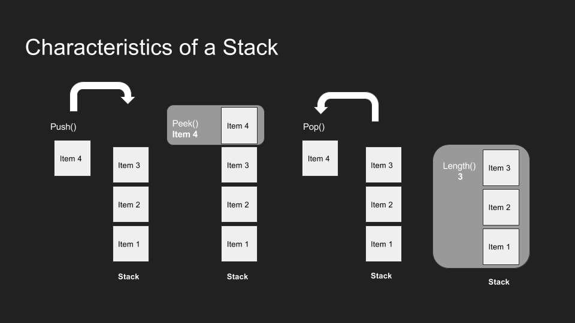
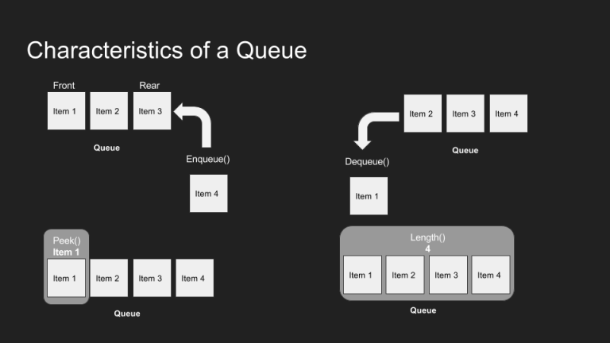

[Back to main page ](README.md)

# Stacks & Queues 

## Stacks 

- what do mean by `stack` ? 
`stack` is a data structure that consists of `Nodes`. Each Node references the next Node in the `stack`, but does not reference its previous.

- Stacks follow these concepts :

1- FILO : first in last out 

2-LIFO : last in first out 

- what are the common terminology used with `stack` ? 

1- `push` 

2- `pop` 

3- `Peek` 

4-`top`

5-`isEmpty`

how a stack looks like ?

- # Big O 

the Big O for all of these termonolgys is 

> Big O(1) 
 

 ## Queues 

 - what do mean by `Queue` ? 

A `Queue` is Linear Data Structure where data elements are arranged sequentially in an array. 

- Queues arefollow this concept :

 1- `FIFO`:First In  First Out .

 2- `LILO` : Last In Last Out.

- what are the common terminology used with `Queue` ? 

1- `Enqueue ` 

2- `Dequeue ` 

3- `Front ` 

4-`Rear `

5-`isEmpty`

6- `Peek` 

how a Queue looks like ?

- # Big O 

the Big O for all of these termonolgys is 

> Big O(1)

- references : [Stacks&Queues](https://codefellows.github.io/common_curriculum/data_structures_and_algorithms/Code_401/class-10/resources/stacks_and_queues.html)