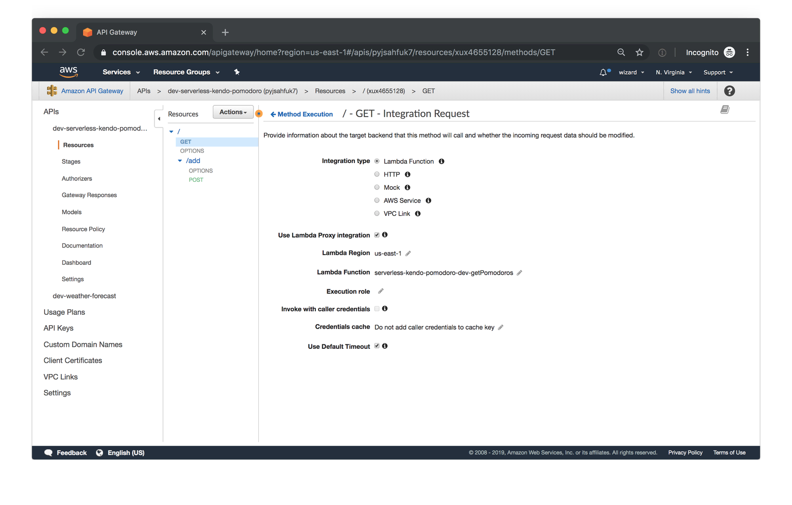
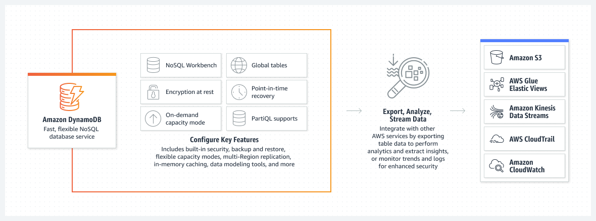

# AWS: API, Dynamo and Lambda

[back to main](./README.md)

`What is Amazon API Gateway?`

Amazon API Gateway is a managed service that allows developers to define the HTTP endpoints of a REST API or a WebSocket API and connect those endpoints with the corresponding backend business logic. It also handles authentication, access control, monitoring, and tracing of API requests.

Many Serverless applications use Amazon API Gateway, which conveniently replaces the API servers with a managed serverless solution.

How does API Gateway work?
API Gateway sits between the backend services of your API and your API’s users, handling the HTTP requests to your API endpoints and routing them to the correct backends. It provides a set of tools that help you manage your API definitions and the mappings between endpoints and their respective backend services. It can also generate API references from your definitions and make them available to your users as API documentation.

API Gateway integrates with many other AWS services like AWS Lambda, AWS SNS, AWS IAM, and Cognito Identity Pools. These integrations allow for fully managed authentication and authorization layers, as well as detailed metrics and tracing for API requests.

The service’s graphical user interface allows you to sketch out the API structure and view the API flows in graphical form after they’ve been created.

While the user interface is a good way to try out API Gateway, we recommend creating your API structure in code, for example, using the Serverless Framework’s built-in API Gateway event.

Why is API Gateway an essential part of the Serverless ecosystem?
Within the Serverless ecosystem, API Gateway is the piece that ties together Serverless functions and API definitions. Being able to trigger the execution of a Serverless function directly in response to an HTTP request is the key reason why API Gateway is so valuable in Serverless setups: it enables a truly serverless architecture for web applications. When using API Gateway together with other AWS services, it’s possible to build a fully functional customer-facing web application without maintaining a single server yourself.

This brings the advantages of the serverless model—scalability, low maintenance, and low cost due to low overhead—to mainstream web applications.

How does API Gateway integrate with other AWS services?
Many AWS services support integration with Amazon API Gateway, including:

AWS Lambda: run Lambda functions to generate HTTP API responses.
AWS SNS: publish SNS notifications when an HTTP API endpoint is accessed.
Amazon Cognito: provide authentication and authorization for your HTTP APIs.
API Gateway supports direct integrations that can be configured in the API Gateway user interface (or via the API Gateway’s own API) for the following actions:

Invoking an AWS Lambda function.
Invoking another HTTP endpoint, with or without VPC Link.
Making an HTTP call against the API of any AWS service that provides an HTTP API.
Returning a mock response generated within API Gateway without calling out to other services.

You can also connect an HTTP endpoint created in API Gateway with a service that doesn’t offer a native integration. Perhaps the best way to achieve this is to set up an AWS Lambda function that contains all the business logic for the integration and then connect that Lambda function with an HTTP endpoint in API Gateway.

How does API Gateway work with the Serverless Framework?
The Serverless Framework uses a Lambda Proxy integration to make API Gateway events easily available to your Serverless functions. For example, for a simple HTTP API you would specify the API Gateway endpoint that you want attached to your Serverless function right in the serverless.yml file:

Copied# serverless.yml functions: index: handler: handler.hello events: - http: GET hello # this is the API Gateway event
    # serverless.yml
 
    functions:
      index:
        handler: handler.hello
        events:
          - http: GET hello # this is the API Gateway event
In this example, the entire payload from the API request will be passed into the handler.hello handler and made available to your Serverless function.

The Serverless framework supports functionality such as using custom authorizers in your serverless.yml file, setting up usage plans for your APIs, validating the request schema, and much more.

Check out the API Gateway event docs for more examples of how to use Amazon API Gateway with the Serverless framework.

Benefits of Amazon API Gateway
Using API Gateway to create HTTP APIs in AWS offers four main benefits:

Map HTTP requests to specific functions in a Serverless application via an API Gateway event. Connecting HTTP endpoints to individual functions is straightforward with API Gateway, obviating the need for a dedicated API server.

Map WebSocket events to Serverless functions. If you are building a WebSocket API, API Gateway also lets you map its events to a Serverless function. This works great for real-time functionality like in-app updates and notifications.

Use multiple microservices to serve the same top-level API. API Gateway makes it easy to have different Serverless functions serving different parts of your API. This means you can better encapsulate your functionality into each function and clearly separate the business logic of different parts of your API. Another benefit here is that you can transparently replace the function called by a given API request—the users won’t notice any change on the API layer.

Save time with integrations: authentication, developer portal, CloudTrail, CloudWatch. API Gateway allows you to implement a fully managed authentication and authorization layer by using Amazon Cognito and Lambda custom authorizers without running your own auth systems. By using API Gateway you also get access to the developer portals that are generated automatically from your API schemas. In addition, CloudTrail, CloudWatch and X-RAY all integrate with API Gateway, simplifying the profiling and debugging of API requests.

These benefits boil down to reducing your time to market for new HTTP APIs and increasing developer productivity, while also ensuring that the solutions your teams are building stay scalable.

Drawbacks to Amazon API Gateway
There are a few caveats when using API Gateway that you should be aware of before using it in production. The main downside is added latency in your APIs: in certain cases, the service can add costly milliseconds to your response times. This issue is exacerbated by the fact that you can’t fine-tune API Gateway—it’s a managed service, and AWS doesn’t allow you to tweak the performance parameters.

That said, the impact on latency won’t be visible unless you are building truly low-latency applications or are combining many API layers. There aren’t many alternatives to API Gateway besides running your own API servers; running your own servers might well be worth it if you’re heading into latency-sensitive territory.

What is API Gateway good for?
The main use case for Amazon API Gateway is in building serverless HTTP APIs. API Gateway stands in as your API server: managing the schema of your HTTP API, connecting each endpoint to the right backend service, and handling the concerns like authentication and throttling.

Amazon API Gateway is probably not the right choice if you’re looking for an ultra-low-latency HTTP request router or if you want a lot of control over how API requests are processed (in these cases, a custom solution may perform better), or if you are building a GraphQL API and would like to manage its schema (check out AWS AppSync for GraphQL APIs).

Amazon API Gateway limits
API Gateway implements several usage limits. Most of these limits can be increased by contacting AWS support, but there are a few limits that can’t be changed:

Regional APIs: you can only have 600 regional APIs per AWS account. That’s a lot; most teams won’t reach this limit.
Integration timeouts: the shortest possible timeout for an integration in API Gateway is 50 ms, and the longest is 29 seconds.
Payload size: the maximum payload size that can be returned by an API endpoint is 10MB. If you’re planning to return more data per request than that, you may need to split up the payload into multiple pages.
In each of these cases, it should be quite possible to build your APIs with API Gateway without running into these limits:

It’s rare that an AWS account would have 600+ API definitions, unless a large number of developers end up creating their own test API schema. The total API count limitation can be addressed by creating multiple AWS accounts for different groups within your organization.
If you’re looking for ultra-low or ultra-high latency for your API endpoints, you may want to create a separate subsystem to manage the latency-sensitive portions of your API and expose the management of those parts as its own API.
If you reach the payload size limit, you may be trying to include large files in your API responses. In that case you can use Amazon S3, AWS’ blob storage service, to store large files and reference them using S3 URLs in your API responses.
Amazon API Gateway pricing
The AWS free tier includes one million (1M) REST API calls per month for the first 12 months of each new AWS account. The WebSocket API free tier is 1M messages and 750,000 connection minutes per month, also for the first 12 months.

After the free tier period, the following pricing applies:

‍

Aspect	Pricing
REST API calls	from $1.51/1M calls to $3.50/1M calls 
REST API caching	from $0.02/hour to $3.80/hour based on the amount of caching memory
WebSocker API messages	from $0.80 to $1.00/1M messages
WebSocket API connection minutes	$0.25/1M connection minutes
‍

Example cost calculation Let’s assume you have a REST API with 1,000 users, and each user makes 10,000 API requests per month on average. For this level of usage you’ll pay:

Total requests: 1,000 x 10,000 = 10,000,000 requests/month Total cost: 10 x $3.50/1M requests = $35.00/month.

If the number of users rises 10x to 10,000, while the average number of API requests stays the same at 10,000/month/user, you’ll end up paying $350.00/month for API Gateway.

Keep in mind that these are just the API Gateway service costs. Of course, you’ll also be charged for the AWS Lambda compute that actually generates your API responses. Check out these example cost calculations for AWS Lambda to see what your AWS Lambda costs might be when providing a backend for an API as in this example.

## API 

`API Types`

`RESTful APIs`

Build RESTful APIs optimized for serverless workloads and HTTP backends using HTTP APIs. HTTP APIs are the best choice for building APIs that only require API proxy functionality. If your APIs require API proxy functionality and API management features in a single solution, API Gateway also offers REST APIs.
WEBSOCKET APIs

Build real-time two-way communication applications, such as chat apps and streaming dashboards, with WebSocket APIs. API Gateway maintains a persistent connection to handle message transfer between your backend service and your clients.
How API Gateway Works

`API Gateway how it works?`

Benefits:

`Efficient API development`

Run multiple versions of the same API simultaneously with API Gateway, allowing you to quickly iterate, test, and release new versions. You pay for calls made to your APIs and data transfer out and there are no minimum fees or upfront commitments.

Performance at any scale

Provide end users with the lowest possible latency for API requests and responses by taking advantage of our global network of edge locations using Amazon CloudFront. Throttle traffic and authorize API calls to ensure that backend operations withstand traffic spikes and backend systems are not unnecessarily called.

Cost savings at scale

API Gateway provides a tiered pricing model for API requests. With an API Requests price as low as $0.90 per million requests at the highest tier, you can decrease your costs as your API usage increases per region across your AWS accounts.
Easy monitoring

Monitor performance metrics and information on API calls, data latency, and error rates from the API Gateway dashboard, which allows you to visually monitor calls to your services using Amazon CloudWatch.
Flexible security controls

Authorize access to your APIs with AWS Identity and Access Management (IAM) and Amazon Cognito. If you use OAuth tokens, API Gateway offers native OIDC and OAuth2 support. To support custom authorization requirements, you can execute a Lambda authorizer from AWS Lambda.

RESTful API options

Create RESTful APIs using HTTP APIs or REST APIs. HTTP APIs are the best way to build APIs for a majority of use cases—they're up to 71% cheaper than REST APIs. If your use case requires API proxy functionality and management features in a single solution, you can use REST APIs.

### What is DynamoDB?

DynamoDB is a hosted NoSQL database offered by Amazon Web Services (AWS). It offers:

reliable performance even as it scales;
a managed experience, so you won't be SSH-ing into servers to upgrade the crypto libraries;
a small, simple API allowing for simple key-value access as well as more advanced query patterns.
DynamoDB is a particularly good fit for the following use cases:

Applications with large amounts of data and strict latency requirements. As your amount of data scales, JOINs and advanced SQL operations can slow down your queries. With DynamoDB, your queries have predictable latency up to any size, including over 100 TBs!

Serverless applications using AWS Lambda. AWS Lambda provides auto-scaling, stateless, ephemeral compute in response to event triggers. DynamoDB is accessible via an HTTP API and performs authentication & authorization via IAM roles, making it a perfect fit for building Serverless applications.

Data sets with simple, known access patterns. If you're generating recommendations and serving them to users, DynamoDB's simple key-value access patterns make it a fast, reliable choice.

### Amazon DynamoDB

How it works
Amazon DynamoDB is a fully managed, serverless, key-value NoSQL database designed to run high-performance applications at any scale. DynamoDB offers built-in security, continuous backups, automated multi-Region replication, in-memory caching, and data export tools.

### Dynamoose ?:

Dynamoose is a modeling tool for Amazon's DynamoDB. Dynamoose is heavily inspired by Mongoose, which means if you are coming from Mongoose the syntax will be very familar.

`Key Features`

Type safety
High level API
Easy to use syntax
Ability to transform data before saving or retrieving documents
Strict data modeling (validation, required attributes, and more)
Support for DynamoDB Transactions
Powerful Conditional/Filtering Support
Callback & Promise support