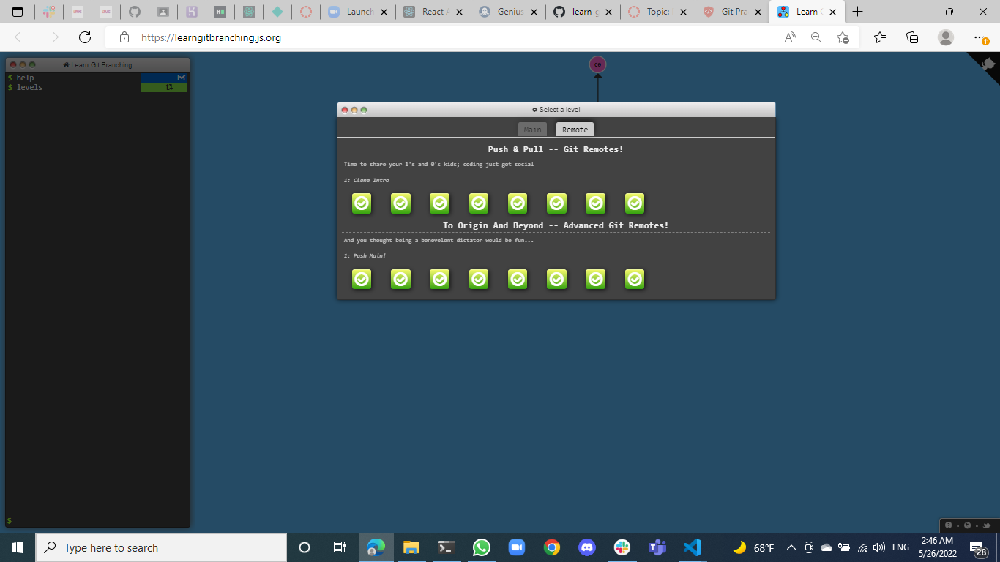

# Learning Git Branching


.png)



## Main

### 1.1 Introduction to Git Commits
```
git commit;
git commit;
```

### 1.2 Branching in Git
```
git branch bugFix;
git checkout bugFix;
```

### 1.3 Merging in Git
```
git checkout -b bugFix;
git commit;
git checkout main;
git commit;
git merge bugFix;
```

### 1.4  Rebase Introduction
```
git checkout -b bugFix;
git commit;
git checkout main;
git commit;
git checkout bugFix;
git rebase main;
```

### 2.1 Detach yo’ HEAD
```
git checkout C4;
```

### 2.2 Relative refs (^)
```
git checkout C4^;
```

### 2.3 Relative refs #2 
```
git branch -f main C6;
git branch -f bugFix C0;
git checkout C1;
```

### 2.4 Reversing Changes in Git
```
git reset local~1;
git checkout pushed;
git revert pushed;
```

### 3.1 Cherry-pick Intro
```
git cherry-pick C3 C4 C7;
```

### 3.2 Interactive Rebase Intro
```
git rebase -i main~4 --aboveAll;
```
*For the solution, order the commits as C3, C5, C4. You may need to omit or pick commits.*

### 4.1 Grabbing Just 1 Commit
```
git checkout main;
git cherry-pick C4;
```

### 4.2 Juggling Commits
```
git rebase -i caption~2 --aboveAll;
git commit --amend;
git rebase -i caption~2 --aboveAll;
git branch -f main caption;
```
*1) For the solution, order the commits as C3, C2. You may need to omit or pick commits.*

*2) For the solution, order the commits as C2'', C3'. You may need to omit or pick commits.*

### 4.3 Juggling Commits #2
```
git checkout main;
git cherry-pick C2;
git commit --amend;
git cherry-pick C3;
```

### 4.4 Git Tags
```
git tag v0 C1;
git tag v1 C2;
git checkout C2;
```

### 4.5 Git Describe
```
git commit;
```

### 5.1 Rebasing over 9000 times
```
git rebase main bugFix;
git rebase bugFix side;
git rebase side another;
git rebase another main;
```

### 5.2 Multiple parents
```
git branch bugWork main~^2~;
```

### 5.3 Branch Spaghetti
```
git checkout one;
git cherry-pick C4 C3 C2;
git checkout two;
git cherry-pick C5 C4 C3 C2;
git branch -f three C2;
```

## Remote


### 1.1 Clone Intro
```
git clone;
```

### 1.2 Remote Branches
```
git commit;
git checkout o/main;
git commit;
```

### 1.3 Git Fetchin’
```
git fetch;
```

### 1.4 Git Pullin’
```
git pull;
```

### 1.5 Fakeing Teamwork
```
git clone;
git fakeTeamwork main 2;
git commit;
git pull;
```

### 1.6 Git Pushin’
```
git clone;
git commit;
git commit;
git push;
```

### 1.7 Diverged History
```
git clone;
git fakeTeamwork;
git commit;
git pull --rebase;
git push;
```
### 1.8 Diverged History
```
git reset --hard o/main
git checkout -b featuer C2
git push origin featuer 
```

### 2.1 Push main!
```
git fetch;
git rebase o/main side1;
git rebase side1 side2;
git rebase side2 side3;
git rebase side3 main;
git push;
```

### 2.2 Mering with remotes
```
git checkout main;
git pull;
git merge side1;
git merge side2;
git merge side3;
git push;
```

### 2.3 Remoting Tracking
```
git checkout -b side o/main;
git commit;
git pull --rebase;
git push;
```

### 2.4 Git push arguments
```
git push origin main;
git push origin foo;
```

### 2.5 Git push arguments — Expanded!
```
git push origin main~1:foo;
git push origin foo:main;
```

### 2.6 Fetch arguments
```
git fetch origin main~1:foo;
git fetch origin foo:main;
git checkout foo;
git merge main;
```

### 2.7 Source of nothing
```
git push origin :foo;
git fetch origin :bar;
```
### 2.8 Pull arguments
```
git pull origin bar:foo;
git pull origin main:side;
```