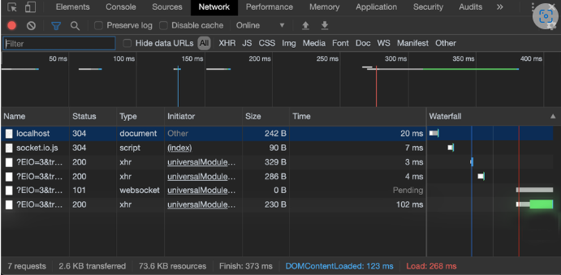

# Web Sockets and Sockets.io

- ### what is Socjket.io?

- Socket.IO is a JavaScript library built on top of WebSocket… and other technologies. In fact, it uses WebSockets when available, but it’s ready to fall back to other technologies such as Flash Socket, AJAX Long Polling, AJAX Multipart Stream, and many more; that allows Socket.IO to be used in contexts where WebSockets are not supported.
***
- ### What is a Web Socket?

- is a computer communications protocol, providing full-duplex communication channels over a single TCP connection

- WebSocket "is designed to work over HTTP ports 443 and 80 as well as to support HTTP proxies and intermediaries", thus making it compatible with HTTP
****
 ### Web Socket request/response handshake and what happens once the connection is established:

 The WebSocket Protocol has two parts: a `handshake` to establish the upgraded connection, then the` actual data transfer`. First, a client `requests` a WebSocket connection by using the `Upgrade`: WebSocket and Connection: `Upgrade headers`, along with a few protocol-specific headers to establish the version being used and set up a `handshake`. The server, if it supports the protocol, replies with the same Upgrade: WebSocket and Connection: Upgrade headers and completes the `handshake`. Once the `handshake` is completed `successfully`, `data transfer begins`.

 The Upgrade header field is an HTTP header field introduced in HTTP/1.1. In the exchange, the client begins by making a cleartext request, which is later upgraded to a newer HTTP protocol version or switched to a different protocol. A connection upgrade must be requested by the client; if the server wants to enforce an upgrade it may send a 426 Upgrade Required response. The client can then send a new request with the appropriate upgrade headers while keeping the connection open

 - JavaScript client example:
```js
// Creates new WebSocket object with a wss URI as the parameter
const socket = new WebSocket('wss://game.example.com/ws/updates');

// Fired when a connection with a WebSocket is opened
socket.onopen = function () {
  setInterval(function() {
    if (socket.bufferedAmount == 0)
      socket.send(getUpdateData());
  }, 50);
};

// Fired when data is received through a WebSocket
socket.onmessage = function(event) {
  handleUpdateData(event.data);
};

// Fired when a connection with a WebSocket is closed
socket.onclose = function(event) {
  onSocketClose(event);
};

// Fired when a connection with a WebSocket has been closed because of an error
socket.onerror = function(event) {
  onSocketError(event);
};
```
*****
- ###  Protocol handshake
To establish a WebSocket connection, the client sends a WebSocket handshake request, for which the server returns a WebSocket handshake response, as shown in the example below.

Client request (just like in HTTP, each line ends with \r\n and there must be an extra blank line at the end):

```rest
GET /chat HTTP/1.1
Host: server.example.com
Upgrade: websocket
Connection: Upgrade
Sec-WebSocket-Key: x3JJHMbDL1EzLkh9GBhXDw==
Sec-WebSocket-Protocol: chat, superchat
Sec-WebSocket-Version: 13
Origin: http://example.com
```
Server response:

```rest
HTTP/1.1 101 Switching Protocols
Upgrade: websocket
Connection: Upgrade
Sec-WebSocket-Accept: HSmrc0sMlYUkAGmm5OPpG2HaGWk=
Sec-WebSocket-Protocol: chat
```


****

- ###  What does the event handler io.on() do?

[important resoures here](https://www.tutorialspoint.com/socket.io/socket.io_event_handling.htm)


Sockets work based on events. There are some reserved events, which can be accessed using the socket object on the server side.


These are :

1-Connect

2-Message

3-Disconnect

4-Reconnect

5-Ping

6-Join 

7-Leave.

*******

The client-side socket object also provides us with some reserved events, which are :

1-Connect

2-Connect_error

3-Connect_timeout

4-Reconnect, etc


- ### What does socket.emit() do?

Socket.IO provides us the ability to create custom events. You can create and fire custom events using the socket.emit function. Following code emits an event called testerEvent −
```js
var app = require('express')();
var http = require('http').Server(app);
var io = require('socket.io')(http);

app.get('/', function(req, res){
   res.sendFile('E:/test/index.html');
});
   
io.on('connection', function(socket){
   console.log('A user connected');
   // Send a message when
   setTimeout(function(){
      // Sending an object when emmiting an event
      socket.emit('testerEvent', { description: 'A custom event named testerEvent!'});
   }, 4000);
   socket.on('disconnect', function () {
      console.log('A user disconnected');
   });
});
http.listen(3000, function(){
   console.log('listening on localhost:3000');
});
```

To handle this custom event on client we need a listener that listens for the event testerEvent. The following code handles this event on the client 

```html

<!DOCTYPE html>
<html>
   <head><title>Hello world</title></head>
   <script src="/socket.io/socket.io.js"></script>
   <script>
      var socket = io();
      socket.on('testerEvent', function(data){document.write(data.description)});
   </script>
   <body>Hello world</body>
</html>
```
This will work in the same way as our previous example, with the event being testerEvent in this case. When you open your browser and go to localhost:3000, you'l be greeted with −
```
Hello world
```
After four seconds, this event will be fired and the browser will have the text changed to −
```
A custom event named testerEvent!
```
***
### Socket.io vs Web Sockets

- What is the difference between WebSocket and Socket.IO? (think Git and GitHub, or OAuth and Auth0).

The main advantages of Socket.IO over WebSockets are:

Unlike WebSocket, Socket.IO allows you to broadcast a message to all the connected clients.

 For instance, if you’re writing a chat application and you want to notify all the connected clients that a new user has joined the chat, you can easily broadcast that message in one shot to everyone.
 
  Using plain WebSocket, you’ll need a list of all the connected clients and then send the message directly one by one.


Proxies and load balancers make WebSockets hard to implement and scale.

 Socket.IO supports these technologies out of the box.

 Socket.IO can fall back to technologies other than WebSockets when the client doesn’t support it.


If (for some reason) a WebSocket connection drops, it will not automatically reconnect… but guess what? Socket.IO handles that for you!


Socket.IO APIs are built to be easier to work with.

### some disadvantages

Socket.IO uses much more boilerplate code and resources to make it fall back to other technologies. Most of the time, you don’t need this level of support. Even in terms of network traffic, Socket.IO is way more expensive. In fact, with plain WebSockets, the browser may need to run just two requests:

The GET request for the HTML page
The UPGRADE connection to WebSocket
and that’s it. You’re ready to start real-time communication with your server! But what about Socket.IO?

The GET request of the HTML page
Socket.IO client library (207kb)
Three long polling Ajax request
The UPGRADE connection to WebSocket
in a world where we’re using many JavaScript code and libraries are drastically reducing their weight… 207kb is a lot! And what about all these requests? What a waste of network traffic!
***

WebSocket network traffic:


Socket.IO network traffic:


When would you use Socket.IO?
***
***

[back to main](./README.md)
### resources 

[ sockets testing tool](https://amritb.github.io/socketio-client-tool/)


[sockest.io client API](https://socket.io/docs/client-api)


[](https://socket.io/docs/server-api)

[Socket.io Documentation](https://socket.io/docs/)

[TCP Handshakes Explained](https://www.youtube.com/watch?v=vv4y_uOneC0)

[OSI Model Explained](https://www.youtube.com/watch?v=vv4y_uOneC0)

[wikipedia](https://en.wikipedia.org/wiki/WebSocket)

[tutorialspoint](https://www.tutorialspoint.com/socket.io/socket.io_event_handling.htm)

[differences](https://itnext.io/differences-between-websockets-and-socket-io-a9e5fa29d3dc)
